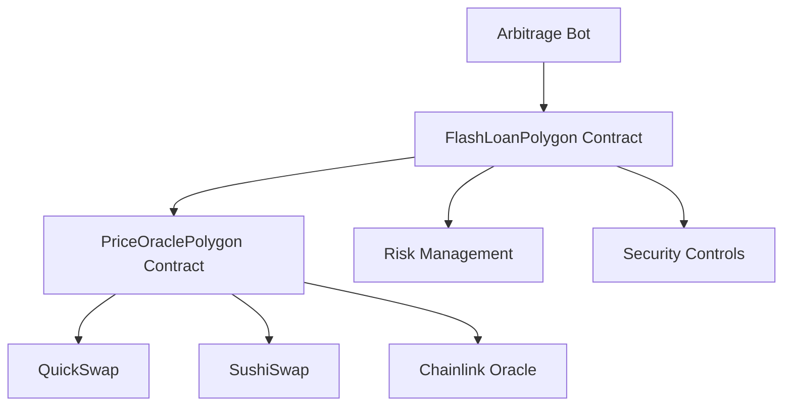

[](https://opensource.org/licenses/MIT)
[](https://soliditylang.org/)
[](https://hardhat.org/)
[](https://polygon.technology/)

# 🚀 Flash Loan Arbitrage Bot for Polygon

This project is an institutional-grade flash loan arbitrage system specifically designed for the Polygon network. It enables capital-efficient trading without upfront funds by leveraging flash loans across multiple DEXs including QuickSwap and SushiSwap.

## 📋 Table of Contents

- [Overview](#overview)
- [Architecture](#architecture)
- [Smart Contracts](#smart-contracts)
- [Bot Implementation](#bot-implementation)
- [Installation](#installation)
- [Testing](#testing)
- [Deployment](#deployment)
- [Configuration](#configuration)
- [Usage](#usage)
- [Risk Management](#risk-management)
- [Troubleshooting](#troubleshooting)
- [Contributing](#contributing)
- [License](#license)
- [Disclaimer](#disclaimer)

## 🔍 Overview

The Flash Loan Arbitrage Bot for Polygon enables automated arbitrage opportunities across Polygon's DEX ecosystem. The system is optimized for Polygon's lower gas costs and faster block times while maintaining enterprise-grade security features.

### Key Features

- **Multi-DEX Arbitrage**: Supports QuickSwap, SushiSwap, and other Polygon DEXs
- **Real-time Monitoring**: Node.js/TypeScript bot for continuous opportunity scanning
- **Risk Management**: Circuit breakers, daily volume limits, and asset risk configurations
- **Gas Optimization**: Optimized for Polygon's lower transaction costs
- **Oracle Integration**: Chainlink price feeds for secure price validation
- **Enterprise Security**: Reentrancy protection, 2-step ownership, and pausable functionality

## 🏗️ Architecture



### Core Components

1. **FlashLoanPolygon.sol**: Main contract implementing flash loan functionality
2. **PriceOraclePolygon.sol**: Price oracle for multi-DEX price feeds
3. **MockOracle.sol**: Mock Chainlink oracle for testing
4. **Arbitrage Bot**: JavaScript/TypeScript implementation for monitoring and execution
5. **Deployment Scripts**: Scripts for Mumbai testnet and Polygon mainnet

## 📄 Smart Contracts

### FlashLoanPolygon.sol

The main contract that implements flash loan functionality optimized for Polygon:

- **Gas Optimized**: Uses unchecked blocks and minimal storage writes
- **Multi-DEX Support**: Can execute arbitrage across multiple DEXs
- **Risk Management**: Implements circuit breakers, daily volume limits, and asset risk configurations
- **Oracle Integration**: Uses Chainlink oracles for price validation
- **Security Features**: Reentrancy protection, 2-step ownership, and pausable functionality

### PriceOraclePolygon.sol

Price oracle contract that provides pricing information from multiple DEXs:

- **Multi-DEX Support**: Supports QuickSwap, SushiSwap, and other Polygon DEXs
- **TWAP Calculations**: Time-weighted average price calculations
- **Chainlink Integration**: Integration with Chainlink price feeds
- **Arbitrage Detection**: Identifies price discrepancies between DEXs

### MockOracle.sol

Mock Chainlink oracle for testing purposes on Mumbai testnet.

## 🤖 Bot Implementation

The arbitrage bot is implemented in both JavaScript and TypeScript:

- **Real-time Monitoring**: Monitors new blocks for arbitrage opportunities
- **Multi-DEX Scanning**: Scans multiple DEXs for price discrepancies
- **Profit Calculation**: Calculates profitability including gas costs
- **Auto-execution**: Automatically executes profitable trades
- **Risk Management**: Stops execution when gas costs exceed potential profits

## 🚀 Installation

### Prerequisites

- Node.js >= 16.0.0
- npm >= 7.0.0
- Hardhat >= 2.26.3

### Setup

```bash
# Clone the repository
git clone <repository-url>
cd FlashLoan

# Install dependencies
npm install

# Navigate to bot directory and install bot dependencies
cd bot
npm install
cd ..
```

## 🧪 Testing

### Unit Tests

```bash
# Run unit tests
npx hardhat test

# Run specific test file
npx hardhat test test/FlashLoanPolygon.test.js
```

### Fork Tests

```bash
# Run fork tests (requires Polygon mainnet fork)
npx hardhat test test/FlashLoanPolygon.fork.test.js
```

### Coverage and Gas Reports

```bash
# Run coverage report
npx hardhat coverage

# Run gas report
REPORT_GAS=true npx hardhat test
```

## 📦 Deployment

### Mumbai Testnet

```bash
# Deploy to Mumbai testnet
npx hardhat run scripts/deploy-polygon-mumbai.js --network mumbai
```

### Polygon Mainnet

```bash
# Deploy to Polygon mainnet
npx hardhat run scripts/deploy-polygon.js --network polygon
```

### Verification

```bash
# Verify contracts on PolygonScan
npx hardhat verify --network polygon <contract-address> <constructor-args>
```

## ⚙️ Configuration

### Environment Variables

Create a `.env` file in the bot directory with the following variables:

```env
# Polygon RPC URL
POLYGON_RPC_URL=https://polygon-rpc.com/

# Wallet private key (keep this secret!)
PRIVATE_KEY=your_private_key_here

# Contract addresses (deployed contracts)
FLASH_LOAN_ADDRESS=your_flash_loan_contract_address_here
PRICE_ORACLE_ADDRESS=your_price_oracle_contract_address_here

# Explorer API keys for verification
POLYGONSCAN_API_KEY=your_polygonscan_api_key_here
```

### Network Configuration

The project is configured to work with the following networks:

1. **Polygon Mainnet**
   - Chain ID: 137
   - RPC URL: https://polygon-rpc.com/

2. **Mumbai Testnet**
   - Chain ID: 80001
   - RPC URL: https://rpc-mumbai.maticvigil.com/

## 📈 Usage

### 1. Compile Contracts

```bash
npx hardhat compile
```

### 2. Deploy Contracts

```bash
# For Mumbai testnet
npx hardhat run scripts/deploy-polygon-mumbai.js --network mumbai

# For Polygon mainnet
npx hardhat run scripts/deploy-polygon.js --network polygon
```

### 3. Run the Bot

```bash
# Navigate to bot directory
cd bot

# Run the bot
npm start
```

### 4. Monitor Logs

The bot will output logs showing:
- Current gas prices
- Block processing
- Arbitrage opportunities found
- Transaction execution results

## 🛡️ Risk Management

### Slippage Protection

The system implements slippage protection with configurable limits to prevent losses from price movements during trade execution.

### Circuit Breakers

Circuit breakers automatically pause the system when abnormal conditions are detected:
- Daily volume limits
- Price deviation thresholds
- Recursion depth limits

### Daily Limits

- **Daily Volume Limit**: 1,000,000 tokens
- **Maximum Recursion Depth**: 3 levels
- **Asset-Specific Risk Configurations**: Per-token limits and risk scores

## 🔧 Troubleshooting

### Common Issues

1. **Compilation Errors**
   ```bash
   # Clean and recompile
   npx hardhat clean
   npx hardhat compile
   ```

2. **Network Connection Issues**
   - Verify RPC URLs in configuration
   - Check network connectivity
   - Ensure sufficient funds for gas

3. **Bot Execution Issues**
   - Check environment variables
   - Verify contract addresses
   - Ensure private key has sufficient funds

### Debugging

```bash
# Enable verbose logging
DEBUG=flashloan:* npm start
```

## 🤝 Contributing

1. Fork the repository
2. Create a feature branch (`git checkout -b feature/amazing-feature`)
3. Commit your changes (`git commit -m 'Add amazing feature'`)
4. Push to the branch (`git push origin feature/amazing-feature`)
5. Open a Pull Request

### Code Standards

- **Solidity**: Follow [Solidity Style Guide](https://docs.soliditylang.org/en/latest/style-guide.html)
- **JavaScript/TypeScript**: ESLint configuration provided
- **Testing**: Minimum 95% code coverage required
- **Documentation**: All functions must include NatSpec comments

## 📄 License

This project is licensed under the MIT License - see the [LICENSE](LICENSE) file for details.

## ⚠️ Disclaimer

**IMPORTANT**: This software is provided "as is" without warranty. Flash loan arbitrage involves significant financial risks including:

- **Smart Contract Risk**: Potential bugs or exploits
- **Market Risk**: Price volatility and slippage
- **Gas Risk**: Network congestion and failed transactions
- **Regulatory Risk**: Changing legal landscape

**Always perform thorough testing and risk assessment before deploying to mainnet with real funds.**

---

## 📞 Support & Contact

- **📧 Email**: [singharya2209@gmail.com]
- **🐛 Issues**: [GitHub Issues](https://github.com/AryaSingh22/The-Flash-Loan/issues)
- **💬 Discussions**: [GitHub Discussions](https://github.com/AryaSingh22/The-Flash-Loan/discussions)
- **📱 Twitter**: [@ARYA_SINGH_BAIS]

---


<div align="center">

**Built with ❤️ for the DeFi Community**

*Empowering the next generation of decentralized finance on Polygon*

</div>